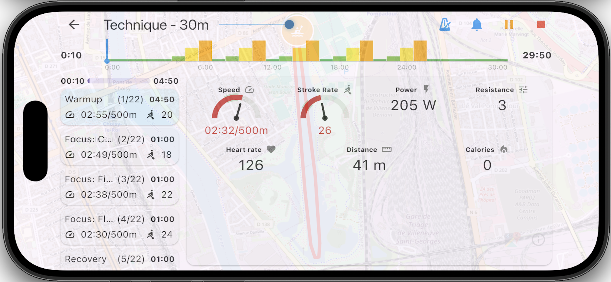
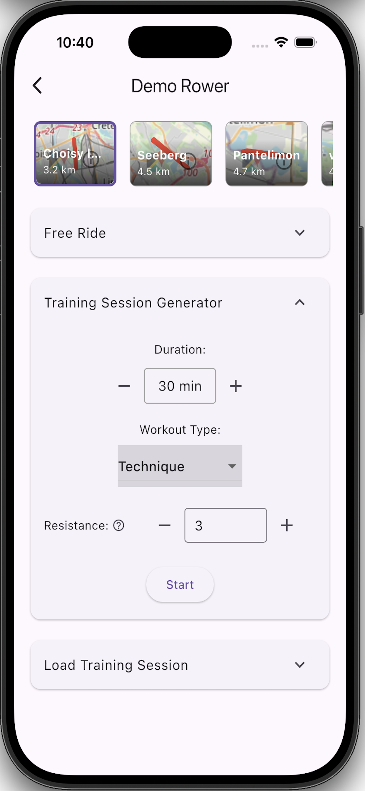
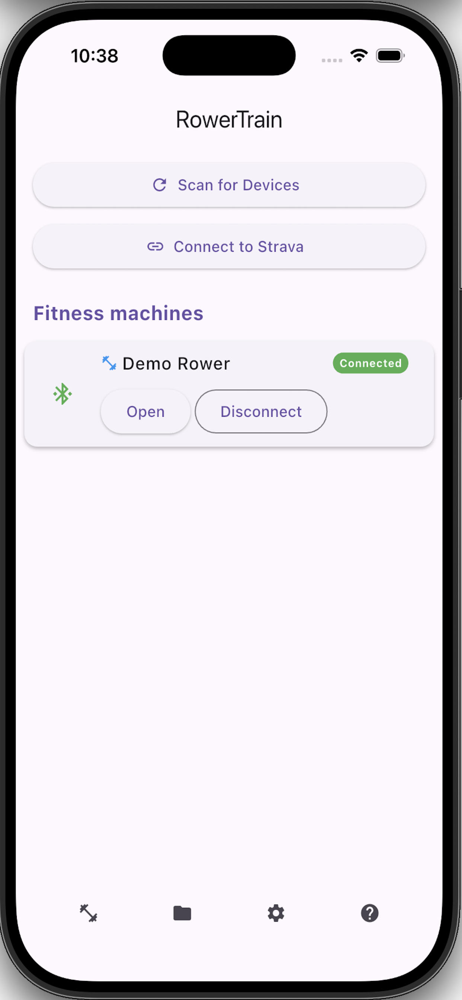
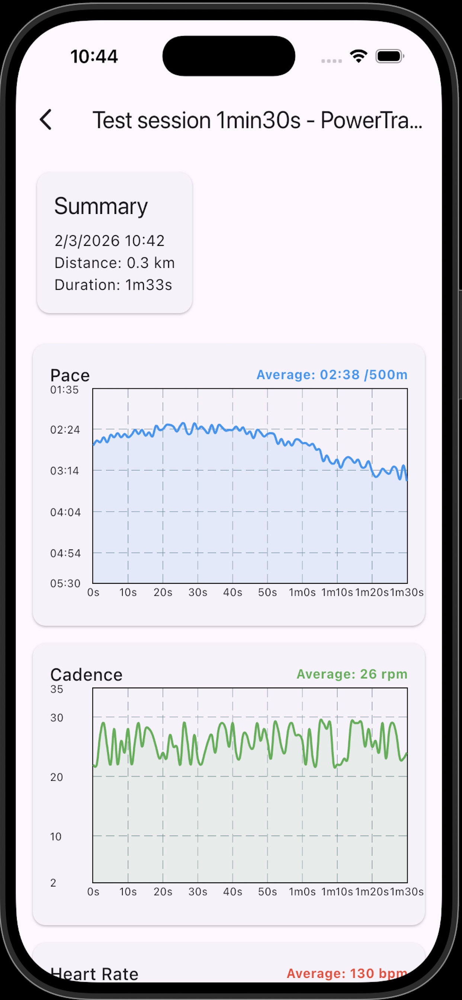
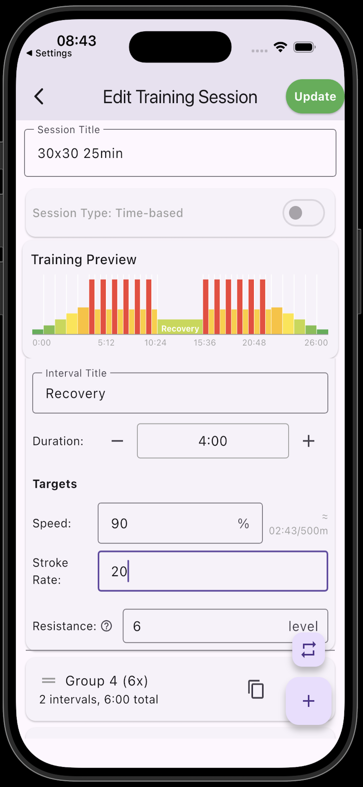
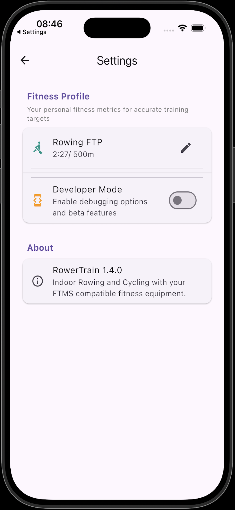


## About

Hello! I'm Adrian, and I've built **RowerTrain** - an app for connected rowers, designed to enhance your training experience and boost your rowing performance.

I originally wrote this app for Decathlon Domyos rowers. It turned out that Decathlon decided to stop maintaining the Domyos eConnected app and direct users to the Kinomap app. I didn't find that app very useful, so I decided to create my own.

RowerTrain works with a wide range of rowing ergometers, including popular models like Domyos 500, 900, Woodrower as well as other brands like Concept2, Christopeit, Merach, and others. If your rower doesn't work with RowerTrain, please let me know. Sometimes rowers, especially entry-level models, don't fully comply with the FTMS protocol. However, thanks to user feedback, I've been able to fix some issues and improve compatibility.

Simply connect your rowing machine to your smartphone via Bluetooth and start your rowing workout session. Your rower must support the Bluetooth FTMS (Fitness Machine Service) protocol to work with RowerTrain.

## Note on the Proposed Training Sessions

The provided training sessions are given as examples. If you find they don't suit you, you can create your own training sessions using the built-in editor. You can also report any issues or errors you encounter so I can fix them.

## Contact & Feedback

I'm open to suggestions and improvements! Feel free to reach out:

**Email:** powertrainapp.sup [at] gmail.com

**Github issues:** Open an [issue](https://github.com/iliuta/iliuta.github.io/issues) on GitHub

## Download RowerTrain App

*Coming soon to the Apple App Store*

## Documentation

[Documentation](https://iliuta.github.io/rowertrain-docs/)

## Features

- **Free Ride Mode**: Set rowing distance or time targets, choose virtual routes, set target pace, stroke rate, and begin your rowing workout
- **Training Session Generator**: Generate structured rowing workouts from predefined rowing training templates
- **Follow Saved Sessions**: Choose from built-in rowing workouts or custom rowing workouts you've created
- **Rowing Workout Editor with Interval Training**: Create and customize rowing interval training sessions. Set targets for stroke rate and pace for each rowing interval
- **Heart Rate Monitor Integration**: Connect Bluetooth heart rate monitors to track your heart rate during rowing training
- **Strava Rowing Integration**: Automatically sync your rowing workouts and rowing data to Strava
- **Virtual Rowing Routes**: Choose from a variety of predefined rowing routes and visualize them on Strava as if you were rowing outdoors

## Screenshots

 

---

## Keywords & Tags

**Rowing App**, **Indoor Rowing**, **Rowing Training**, **Fitness App**, **Rowing Machine App**, **Rowing Ergometer**, **Rowing Workout**, **Rowing Software**, **Rowing Coach**, **Rowing Timer**, **Rowing GPS**, **Rowing Bluetooth**, **FTMS Rowing**, **Rowing Interval Training**, **Rowing Heart Rate**, **Rowing Strava**, **Rowing Performance**, **Rowing Analytics**, **Domyos Rowing**, **Concept2 Rowing**, **Rowing Equipment**, **Rowing Fitness**, **Rowing Exercise**, **Rowing Cardio**, **Indoor Rowing Machine**, **Rowing Training App**, **Rowing Workout Generator**, **Rowing Pace Training**, **Rowing Stroke Rate**, **Rowing Power Meter**

